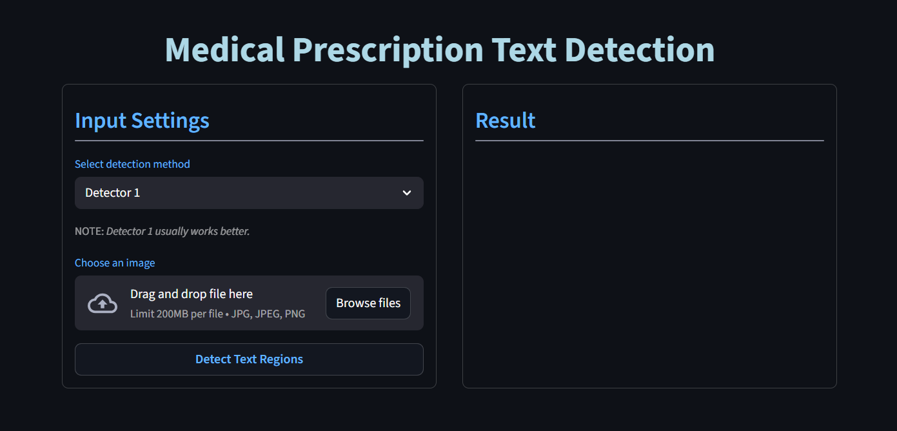
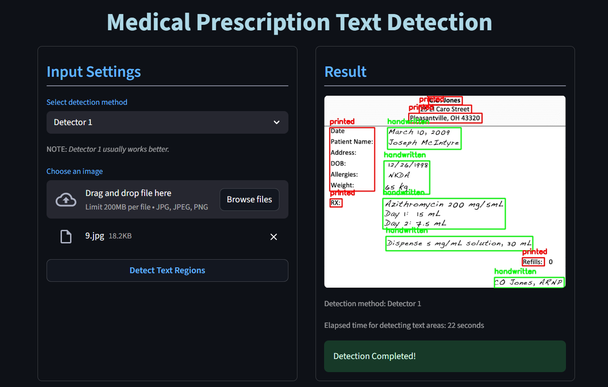

# **Medical Prescription Text Detection Application**

This application is used for detecting printed and handwritten text regions of a medical prescription image.
This model supports texts in English and Farsi(Persian) language.


Can be run:

- without GUI
- with GUI(web app; locally)


### Application Overview





## **Preparation**

## prerequisites
- Python 3.11.9
- pip 25.1.1

## Installation
1. **Create virtual Environment**

```bash
  python -m venv .venv
  .\.venv\Scripts\activate    # Windows
  source .venv/bin/activate   # Linux/Mac
```

2. **Clone and Setup**

3. **Install Dependencies**
```bash
  pip install -r requirements.txt
```

## **Usage Guide**
Run application with GUI(web app):
```bash
  streamlit run UI\main.py
```
or if you want to run it without GUI:

- Case 1; using available pretrained model
```    
run main.py
------------------------------------------------------------
note: give the correct path of your test image to function.
``` 

- Case 2; train model with your own dataset
```    
run train_model.py
run main.py
-----------------------------------------------------------
note: give the correct path of your saved model to function.
note: give the correct path of your test image to function.
``` 


    

## **Inside The Model**

The approach used in this application has two main steps:

- Detecting all text areas
- Classify the detected areas into printed or handwritten

This application contains 2 methods for detecting the text regions:
    
- Detector 1: contours and EasyOCR (default)
- Detector 2: contours, adaptivethresholding and morphology


## **output sample**


## **Folder Structure**
This structure is used when the project was getting worked on.
```text
project/
|
|--- CLASSIFICATION_MODEL/
|     |--- classification_model.py
|     |--- processing.py
|
|--- data/
|     |--- test/
|     |--- train/
|     |     |--- printed/
|     |     |--- handwritten/
|     |--- validation/
|           |--- printed/
|           |--- handwritten/
|
|--- PREPROCESSING/
|     |--- detection_models.py
|     |--- feature_extraction.py
|     |--- load_file
|
|--- screenshots/
|
|--- TEMP/
|
|--- UI/
|     |--- main.py
|
|--- boosted_model.pkl
|--- main.py
|--- README.md
|--- requirements.txt
|--- train_model.py
```
